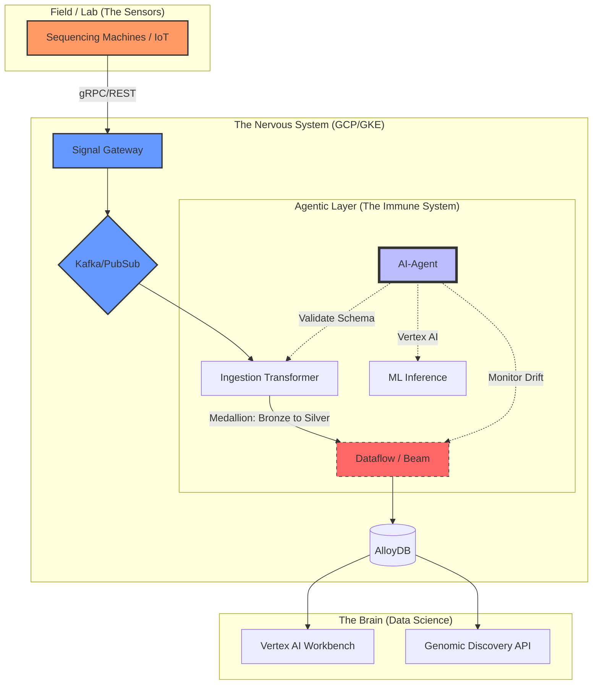

# Mia Ai Agri Genome Stream ⚡

Enterprise "Agricultural Nervous System" for Genomic Data Orchestration

## 🎯 The Mission
To support a global population of 9.6B by 2050, agricultural solutions must scale beyond human-manual analysis. mia-ai-agri-genome-stream is a Proof of Concept (PoC) for an **Agentic Data Pipeline** designed to ingest, transform, and annotate terabytes of genomic variant data in real-time.

This project implements a "Nervous System" architecture:

1. **Sense:** Ingesting high-throughput DNA sequencing and field sensor data via **Kafka.**
2. **Process:** Distributed transformation using **Go** and **Apache Beam (Dataflow).**
3. **Analyze:** Real-time anomaly detection and metadata enrichment via **Vertex AI** Agents.
4. **Store:** High-performance persistence in **AlloyDB** for downstream scientific research.

---

## 🏗️ Architecture




---

## 📂 Repository Structure

<details>
<summary><b>▶ Click to expand full directory tree</b></summary>

```text
mia-ai-agri-genome-stream/
├── api/
│   ├── openapi/                # REST API Specifications (Swagger/OAS)
│   └── proto/                  # gRPC Definitions (Genomic Data Buffers)
├── cmd/
│   └── main.go                 # Application Entry Point
├── services/
│   ├── signal-gateway/         # OT-to-Cloud Entry (SCADA Ingestion)
│   ├── ingestion-transformer/  # Medallion Logic (Bronze -> Silver)
│   ├── worker-dataflow/        # Apache Beam/Dataflow Go SDK Pipeline
│   └── ai-agent/               # Agentic Observability & Anomaly Detection
├── pkg/
│   ├── genomics/               # Domain Logic: VCF/FASTQ Parsing
│   ├── vertexai/               # LLM/Gemini Integration Wrappers
│   └── resilience/             # Circuit Breakers & Retry Logic
├── terraform/
│   ├── environments/           # Dev/Prod Specific Configs
│   └── modules/                # Reusable IaC (GKE, AlloyDB, KMS)
├── notebooks/                  # Vertex AI / Jupyter Research Lab
├── schemas/
│   ├── avro/                   # Kafka Topic Schemas
│   └── protobuf/               # Internal Service Contracts
├── docs/
│   ├── architecture/           # Mermaid Source & Blueprints
│   └── compliance/             # NIST 800-53 Mapping Docs
└── Makefile                    # Global Build & Deploy Orchestration

```
---
## 🧩 Component Breakdown

| Layer | Module | Responsibility | Key Tech Stack |
| :--- | :--- | :--- | :--- |
| **Ingestion** | `signal-gateway` | High-throughput entry for SCADA & Lab IoT | Go, gRPC, Cloud KMS |
| **Transport** | `kafka-backbone` | Event-driven "Nervous System" messaging | Confluent Kafka, Avro |
| **Processing** | `worker-dataflow` | Medallion transformation (Bronze → Silver) | Apache Beam, GCP Dataflow |
| **Intelligence** | `ai-agent` | Agentic Observability & Anomaly Detection | Vertex AI, Gemini 1.5 Flash |
| **Persistence** | `alloydb-gold` | High-performance PostgreSQL for Research | GCP AlloyDB, pgvector |
| **Domain Logic**| `pkg/genomics` | Scientific parsing (VCF, FASTQ, FASTA) | Go, Protocol Buffers |
| **Infrastructure**| `terraform` | Multi-env GKE & VPC Network isolation | HCL, Terraform Cloud |
| **Security** | `docs/compliance` | NIST 800-53 Mapping & IAM Guardrails | Cloud IAM, VPC-SC |

---
</details>


## 🛠️ Technical Stack
* Language: Go (Golang) 1.21+
* Stream Processing: Apache Kafka / Google Cloud Dataflow (Beam)
* Orchestration: Google Kubernetes Engine (GKE)
* Database: AlloyDB (PostgreSQL-compatible)
* AI/ML: Vertex AI (Gemini Pro/Flash 1.5)

## 🛡️ Security & Compliance
This PoC is built following the NIST 800-53 framework, ensuring that sensitive genomic datasets are:
* Security **NIST 800-53** Compliance Framework & GCP KMS
* Encrypted at rest via **GCP KMS.**
* Isolated within a private **VPC Service Perimeter.**
* Subject to **IAM** least-privilege access controls.

## 💡 Implementation Note
> The "Agentic" component of this architecture doesn't just monitor system uptime; it validates Data Integrity. If a DNA sequence variant falls outside of expected biological parameters (Genotype-to-Phenotype drift), the AI-Agent flags the event in the Silver layer before it reaches the Gold research database.

## 🚀 Getting Started
1. Prerequisites
* Google Cloud SDK installed and authenticated.
* Terraform 1.5+
* Go 1.21+
* A running Kafka cluster (or Confluent Cloud).

2. **Infrastructure Setup**
```bash
cd terraform/environments/dev
terraform init
terraform apply
```
3. **Running the "Nervous System" Agent**
```bash 
cd services/ai-agent/cmd
go run main.go
```

## 🛡️ Architect's Note for the README
> "We leverage **VPC Service Controls (VPC-SC)** to create a security perimeter around our sensitive genomic data, ensuring that even with valid credentials, data cannot be exfiltrated outside the project boundary."


## 📝 Author
Alf - AI Solution Architect / Sr. Cloud Solutions Architect and hands on Engineer

